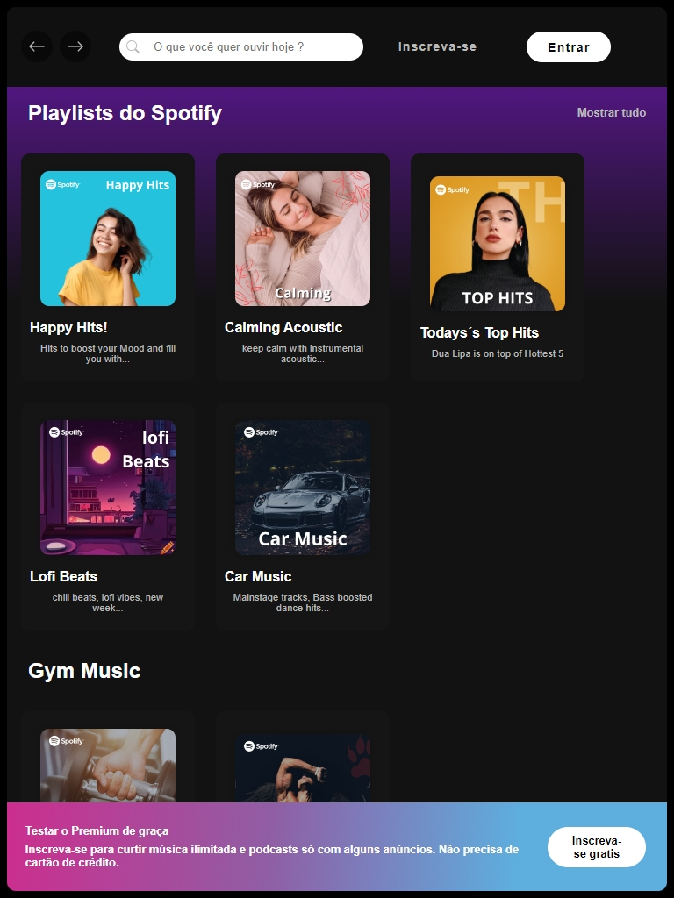
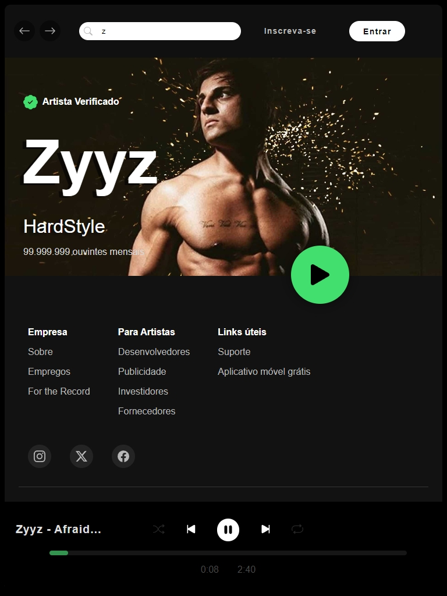

# Spotify Clone Frontend + Player de Música

Este é um projeto incrível que foi desenvolvido com as tecnologias HTML5, CSS3 e JavaScript.

 
 
 

  

  
   

## Como funciona
O projeto foi uma proprosta da Imersão Frontend da ALURA , porém decidi ir além , fiz meu próprio código e css usando apenas a ideia que foi passada nas aulas da imersão , decidi também criar um player de Música com JavaScript , com uma "api" que criei com artistas e uma música do mesmo. Também editei as imagens dos cards

## Pesquisar por artistas 

A pesquisa se baseia na primeira letra digitada, coloquei os seguintes artistas na "API":

<ul>
  <li>Real Music NF</li>
  <li>Michael Jackson</li>
  <li>Nick Jonas</li>
  <li>Taylor Swift</li>
  <li>Justin Bieber</li>
  <li>Adele</li>
  <li>Dua Lipa</li>
  <li>Eminem</li>
  <li>Iguinho</li>
  <li>Zyyz</li>
  <li>Karen Harding</li>
</ul>

E também 1 música para cada ( Dua Lipa contém 2 músicas para testar o botão de passar música )

## Player de Música 

O player de música foi desenvolvido foi JS puro, com o funcionamento dos botões de Play/Pause , e next e previous , ( em breve os botões de Shuffle e repeat 😅)

## Play() error:
### Uncaught (in promise) DOMException: The play() request was interrupted by a call to pause()
infelizmente contém erros de requisição que podem ser resetados ao recarregar a página. ( função que coloquei a digitar um novo artista )

## Design Responsivo 

Adaptei o projeto para todos os tipos de Telas, como uma boa prática de responsive Design

